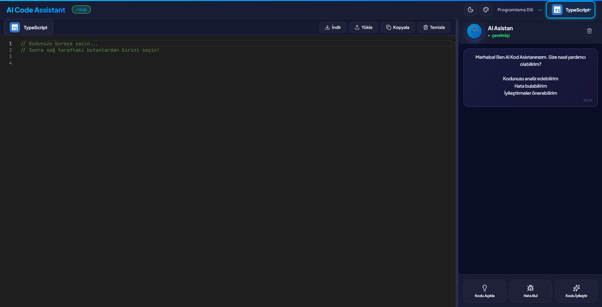

# AI Code Assistant

### *Kodlamayı Yeniden Keşfedin*

**Yapay zeka destekli, modern ve güçlü bir kod editörü.  
Sadece yazmayın, AI ile birlikte geliştirin!**

🌐 **Web Site:**  
[https://ai-code-assistant-vert.vercel.app](https://ai-code-assistant-vert.vercel.app)

---

##  Neden AI Code Assistant?

Geleneksel kod editörleri yalnızca yazmanıza izin verir.  
**AI Code Assistant** ise yazdığınız kodu **anlar, analiz eder ve geliştirir.**

### 💡 Karşılaşılan Problemler
- ❌ Kod hatalarını bulmak zaman alır  
- ❌ Karmaşık kodları anlamak zordur  
- ❌ Optimizasyon için deneyim gerekir  
- ❌ Farklı dillerde aynı kaliteyi yakalamak zordur  

### ✨ Çözüm
- ✅ **Anında hata analizi**
- ✅ **Kod satır satır açıklama**
- ✅ **Otomatik iyileştirme önerileri**
- ✅ **8+ dil desteği**

---

## ⭐ Öne Çıkan Özellikler

<table>
<tr>
<td width="50%">

###  AI Destekli Kod Analizi
- Kodu açıkla  
- Hata tespiti  
- Performans önerileri  
- Best practice yönlendirmeleri  

</td>
<td width="50%">

###  Gerçek Zamanlı IntelliSense
- VS Code kalitesinde editör  
- Monaco Editor altyapısı  
- Akıllı kod tamamlama  
- Parametre ve tip ipuçları  

</td>
</tr>

<tr>
<td width="50%">

###  Tema Sistemi
- Koyu / Açık mod  
- 3 farklı renk paleti  
- Akıcı ve modern animasyonlar  

</td>
<td width="50%">

###  Akıllı Kaydetme
- Otomatik LocalStorage  
- Dosya import / export  
- Veri kaybı riski yok  

</td>
</tr>
</table>

---

##  Nasıl Çalışır?

1️⃣ Kodunuzu yazın  
2️⃣ AI ile analiz edin  
3️⃣ Sonuçları anında görün  
4️⃣ İyileştirilmiş kodu uygulayın  

---

##  Desteklenen Diller

| JavaScript | TypeScript | Python | Java |
|-----------|------------|--------|------|
| ✅ | ✅ | ✅ | ✅ |

| C++ | C# | HTML | CSS |
|-----|----|------|-----|
| ✅ | ✅ | ✅ | ✅ |

---

##  Ekran Görüntüleri

### Koyu Tema

### Açık Tema

---

##  Proje İstatistikleri

| Metrik | Değer |
|------|------|
| Desteklenen Diller | 8+ |
| Ortalama Yanıt Süresi | < 2 sn |
| Kod Analiz Başarısı | %95+ |

---

##  Kullanılan Teknolojiler

**Frontend**
- React
- TypeScript
- Vite
- Monaco Editor
- Lucide Icons

**Backend**
- FastAPI
- Python
- Claude AI

**Styling**
- CSS3
- CSS Variables
- Animations

---

##  Katkıda Bulunun

Bu proje **açık kaynak** ve katkılara açıktır.

- 🐞 Bug bulduysanız Issue açabilirsiniz  
- 🔀 Pull Request gönderebilirsiniz  
- 💡 Yeni özellik önerilerinde bulunabilirsiniz  
- 📧 İletişim: **burak.turgut.dev@gmail.com**

---

## 📬 İletişim

Proje, iş birlikleri veya geri bildirimler için benimle iletişime geçebilirsiniz:

-  **E-posta:** burak.turgut.dev@gmail.com  
-  **LinkedIn:** [https://www.linkedin.com/in/burakkturgut](https://www.linkedin.com/in/burakkturgut)

---

### Geleceğin Kod Editörü, Bugün

👉 **[Hemen Deneyin](https://ai-code-assistant-vert.vercel.app)**

---

© 2026 **Burak Turgut**

